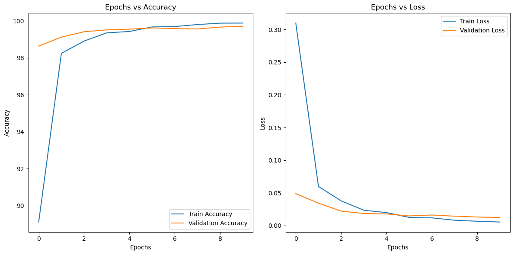
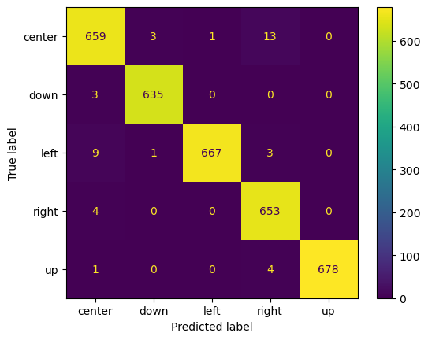
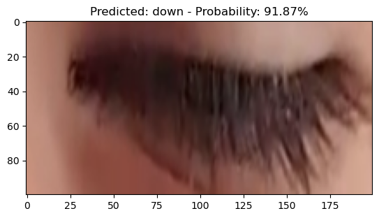
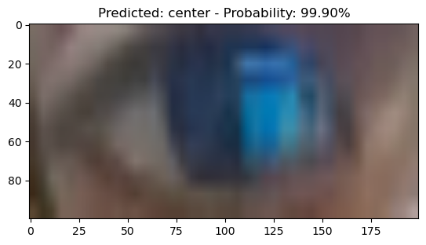

# -Eye-Movement-Recognition-using-Vision-Transformers-ViT-Model-in-PyTorch
### Dataset
I used a collected diverse private dataset consist from 10,000 images.
### Methods
- The Vision-Transfromer ViT-b-16 model is used for training and validating.
- To avoid over fitting a cross-validation n-folds method is utilized.
- Transformations included Normalization, Converting to Tensor, Random Resize, and Crop.
### Results
> ### **Accuracy and Loss Curves over Epochs**

> 

> ### **Confusion Matrix**
> 

> ### **Unseen Batch Testing Samples**
> 

> 
>
>    

